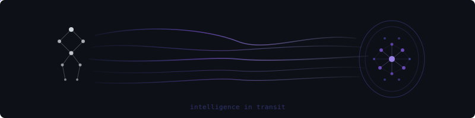

  

<h3 align="center">hi, i'm alexey</h3>

  <em>most of what i build, you won't find here.</em>

---

i tend to work from behind the scenes — architecture, research, the parts that don't come with a star button.

what's public is the tip. deep in bittensor, previously broke things at eigenlayer, chainlink, and whatever hackathon we showed up to with [2bb](https://2bb.dev).

currently researching how LLMs reason (or don't).

 

  

 

  <picture>
    <source media="(prefers-color-scheme: dark)" srcset="https://raw.githubusercontent.com/ztsalexey/ztsalexey/output/github-snake-dark.svg" />
    <source media="(prefers-color-scheme: light)" srcset="https://raw.githubusercontent.com/ztsalexey/ztsalexey/output/github-snake.svg" />
    
  </picture>

